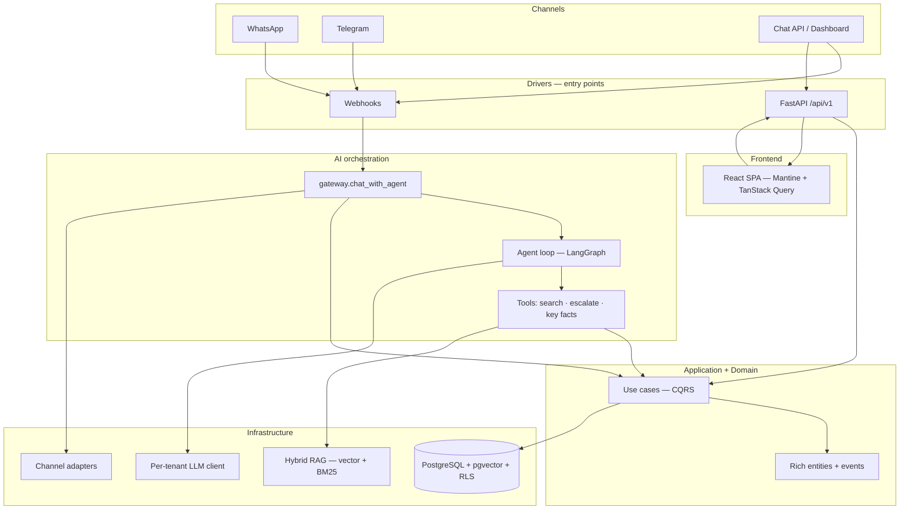

# frontdesk

Multi-tenant AI front desk that answers on your behalf. Tenants upload
their knowledge base, connect WhatsApp and Telegram, and the AI handles
incoming questions — grounded in the tenant's own documents. Anything the
AI can't answer gets routed to the owner's inbox for a human reply.

## Start here

| | |
|---|---|
| **Run it** | [Quick start](#quick-start) — Docker one-liner below |
| **Contribute** | [CONTRIBUTING.md](CONTRIBUTING.md) — setup, checks, PR guide, good first issues |
| **Backend design** | [backend/docs/ARCHITECTURE.md](backend/docs/ARCHITECTURE.md) — DDD layers, bounded contexts, adding a feature |
| **Frontend design** | [frontend/docs/ARCHITECTURE.md](frontend/docs/ARCHITECTURE.md) — features, auth, DataTable, i18n |
| **Data model** | [backend/docs/ERD.md](backend/docs/ERD.md) |
| **Report a bug / request a feature** | [Open an issue](https://github.com/orwa-mahmoud/frontdesk/issues/new/choose) |

## Architecture



**Dependency direction (backend):** drivers → application → domain ←
infrastructure. The `ai/` layer orchestrates by calling use cases — never
repositories or ORM directly. LangGraph is isolated to a single file:
`backend/src/infrastructure/ai/graph.py`.

Deeper dives: [backend architecture](backend/docs/ARCHITECTURE.md) ·
[RAG pipeline](backend/docs/RAG_PIPELINE.md) ·
[AI orchestration](backend/docs/AI_ORCHESTRATION.md) ·
[channel integration](backend/docs/CHANNEL_INTEGRATION.md) ·
[frontend architecture](frontend/docs/ARCHITECTURE.md).

## How it works

1. **Owner registers** and creates a tenant.
2. **Uploads documents** (PDF, DOCX, Markdown, plain text) — chunked,
   embedded, and indexed for hybrid retrieval.
3. **Connects channels** — WhatsApp and Telegram via the settings dashboard.
4. **Contacts message** through any connected channel.
5. **AI answers** using RAG over the tenant's documents.
6. **Unanswered questions** land in the owner's inbox with the AI's
   attempted answer for context.
7. **Owner replies** from the dashboard — the response relays back
   through the original channel.

The AI remembers key facts about each contact across conversations and
tracks token usage per tenant with full cost accountability.

## Stack

| Layer | Tech |
|-------|------|
| Backend | Python 3.13 · FastAPI · LangGraph · PostgreSQL 17 + pgvector |
| Frontend | React 19 · Mantine 9 · TypeScript · Vite · TanStack Query · i18n (EN/AR + RTL) |
| AI | Hybrid RAG (vector + BM25 + RRF) · per-turn LangGraph orchestration |
| Channels | WhatsApp Cloud API · Telegram Bot API |
| Observability | Prometheus metrics · structlog · request ID tracing |

## Quick start

### Docker (recommended)

Requires Docker + Docker Compose. Brings up Postgres (with pgvector), Redis,
the backend, and the frontend.

```bash
cp .env.docker.example .env.docker
# Edit .env.docker: set JWT_SECRET_KEY and ENCRYPTION_KEY (commands are in the file).
docker compose up --build
# Frontend: http://localhost:3000   API: http://localhost:8000
```

The backend container applies database migrations on startup, so the schema is
ready on first boot. The frontend is served by nginx, which reverse-proxies
`/api` and `/webhooks` to the backend — so the app talks to the API over the
same origin (no CORS, and the auth cookie stays first-party).

### Local (without Docker)

Requires PostgreSQL 17 with pgvector, Python 3.13 with `uv`, Node 22+.

```bash
# Backend
cd backend
cp .env.example .env
uv sync --extra dev
createdb frontdesk_db && psql frontdesk_db -c 'CREATE EXTENSION vector;'
uv run alembic upgrade head
uv run uvicorn src.main:app --reload --port 8000

# Frontend
cd frontend
npm install
npm run dev    # http://localhost:5173 (Vite proxies /api + /webhooks to :8000)
```

## Frontend highlights

- **Bilingual UI (English + Arabic) with full RTL** — language switcher in the
  app shell, self-hosted Arabic font, layout mirrors via Mantine's
  `DirectionProvider`. Backend API error messages localize via `Accept-Language`.
- **Light / dark mode** toggle.
- **Unified DataTable** — one mode-agnostic table over a `TableSource` contract
  (client-side *or* server-paginated), with sort, search, a filter drawer +
  removable chips, responsive desktop/mobile, URL-synced state, row actions with
  confirm modals, and reduced-motion-aware entrance animations.
- **Route-level code splitting**, path aliases, typed config, Prettier + strict
  TypeScript/ESLint.

## Notes & current limitations

- **Authentication is cookie-based.** Login/register set an httpOnly
  `frontdesk_token` cookie (the SPA never stores the JWT in JS, so it is not
  exposed to XSS). The API also accepts a `Bearer` token for programmatic
  clients (curl, scripts, the test suite).
- **One tenant per user (v1).** A user is currently resolved to their first
  tenant membership. Multi-tenant *data isolation* is fully enforced
  server-side, but a per-user tenant switcher is not built yet.
- **`/auth/refresh` is a sliding-session re-issue**, not a separate
  refresh-token grant: it mints a fresh access token for the already
  authenticated user. The `JWT_REFRESH_TOKEN_EXPIRE_DAYS` setting is reserved
  for a future refresh-token flow.

## Documentation

| Doc | What it covers |
|-----|---------------|
| [Contributing](CONTRIBUTING.md) | Dev setup, checks, where to change code, PR expectations, good first issues |
| [Backend architecture](backend/docs/ARCHITECTURE.md) | DDD layers, bounded contexts, entity patterns, CQRS |
| [RAG pipeline](backend/docs/RAG_PIPELINE.md) | Chunking, embedding, hybrid retrieval |
| [AI orchestration](backend/docs/AI_ORCHESTRATION.md) | Agent loop, tools, LangGraph, prompt design |
| [Channel integration](backend/docs/CHANNEL_INTEGRATION.md) | WhatsApp/Telegram adapters, contact resolution |
| [Data model](backend/docs/ERD.md) | Entity relationship diagram |
| [Setup guide](backend/docs/SETUP.md) | Full environment setup |
| [Frontend architecture](frontend/docs/ARCHITECTURE.md) | Components, state management, routing |
| [Design system](frontend/docs/DESIGN_SYSTEM.md) | Theme, colors, component patterns |

## Contributing

Contributions are welcome — bugs, features, docs, and tests. See
[CONTRIBUTING.md](CONTRIBUTING.md) for local setup, which checks to run, and
[good first issues](CONTRIBUTING.md#good-first-issues) if you're looking for a
place to start.

## License

This project is licensed under the [MIT License](LICENSE).
