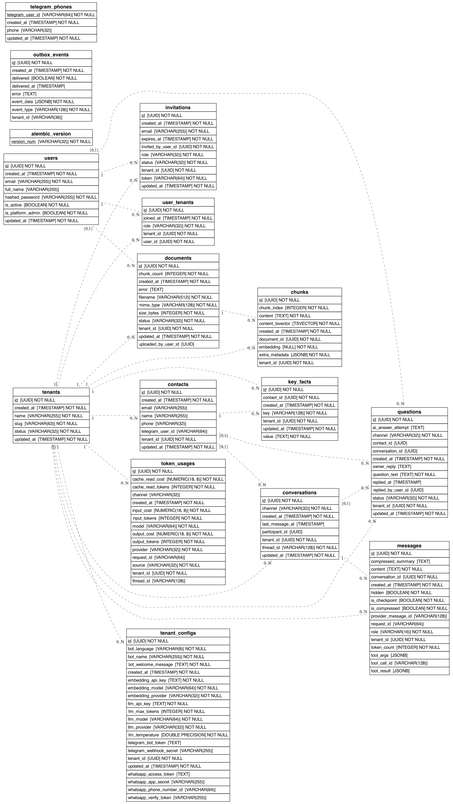

# Sight Database ERD

Entity-relationship diagram for `src/infrastructure/persistence/postgres/models`,
generated directly from the live schema.

## Diagram

> Auto-generated from the database by
> [`scripts/generate_erd.py`](../scripts/generate_erd.py) — run `make erd` (from
> the repo root) after a migration to refresh it. The tables below are the
> authoritative reference for fields and constraints.

---

## Tables Overview

### Core

| Table | Purpose |
| ----- | ------- |
| **tenants** | Business accounts. Multi-tenant root. Fields: name, slug (unique), status (active/suspended). |
| **tenant_configs** | Per-tenant configuration: LLM provider/model/key, embedding config, WhatsApp and Telegram credentials, bot personality (name, welcome message, language). One row per tenant (unique constraint). |
| **users** | Owner/staff accounts. Fields: email (unique), hashed_password, full_name, is_active, `is_platform_admin` (platform super-admin). |
| **user_tenants** | User membership in a tenant. Role is owner or staff. Unique constraint on (user_id, tenant_id). |
| **invitations** | Pending tenant invitations. Fields: email, role, token (unique), status (pending/accepted/rejected/revoked), expires_at. FKs: tenant_id, invited_by_user_id. |

### Contacts & Conversations

| Table | Purpose |
| ----- | ------- |
| **contacts** | External people who interact with a tenant's front desk. Identified by phone (unique per tenant). Optional: name, email, telegram_user_id. |
| **telegram_phones** | Maps Telegram user IDs to phone numbers for contact resolution. Standalone table (no tenant FK) — Telegram user identity is global. |
| **conversations** | Chat threads. One per participant + tenant + channel. Identified by unique `thread_id` (e.g. `whatsapp:{phone}:{tenant_id}`). FK to contacts via `participant_id`. |
| **messages** | Append-only chat log. Fields: role (user/assistant/tool), content, hidden flag. Tool exchange fields: `tool_call_id`, `tool_args` (JSONB), `tool_result` (JSONB). Compression fields: `is_compressed`, `compressed_summary`. Checkpoint: `is_checkpoint`, `token_count`. De-dup: `provider_message_id` (WhatsApp wamid / Telegram id), unique per conversation. |

### Knowledge Base

| Table | Purpose |
| ----- | ------- |
| **documents** | Uploaded files for the RAG knowledge base. Status machine: uploaded -> ingesting -> ready / failed. Tracks filename, mime_type, size_bytes, chunk_count, error. FK to users via `uploaded_by_user_id`. |
| **chunks** | Text slices from documents with embeddings. Fields: content, `embedding` (vector(1536) with HNSW index), `content_tsvector` (generated column with GIN index), chunk_index, extra_metadata (JSONB). FK to documents and tenants. |

### Escalations

| Table | Purpose |
| ----- | ------- |
| **questions** | Escalated questions with full lifecycle. Fields: question_text, ai_answer_attempt, status (submitted/resolved/closed), owner_reply, replied_by_user_id, replied_at. FKs to tenants, conversations, contacts, users. |

### AI Memory

| Table | Purpose |
| ----- | ------- |
| **key_facts** | Key-value facts about a contact within a tenant (preferences, name, context from past conversations). Unique constraint on (tenant_id, contact_id, key). Used as AI memory context. |

### Usage & Infrastructure

| Table | Purpose |
| ----- | ------- |
| **token_usages** | LLM token usage tracking per call. Fields: provider, model, source, channel, input/output/cache_read tokens, input/cache_read/output cost as Decimal(18,8). Indexed by tenant_id, thread_id, request_id, created_at. |
| **outbox_events** | Transactional outbox for reliable domain event publishing. Fields: event_type, event_data (JSONB), tenant_id, delivered flag, delivered_at, error. |

---

## Key Constraints

| Constraint | Table | Purpose |
| ---------- | ----- | ------- |
| `uq_contacts_tenant_phone` | contacts | `(tenant_id, phone)` — prevents duplicate contacts per tenant |
| `thread_id` UNIQUE | conversations | Prevents duplicate threads |
| `uq_messages_conversation_provider_msg` | messages | partial unique `(conversation_id, provider_message_id)` WHERE not null — durable webhook de-dup |
| `uq_user_tenant` | user_tenants | `(user_id, tenant_id)` — one membership per user per tenant |
| `uq_tenant_config_tenant` | tenant_configs | One config row per tenant |
| `uq_key_fact_per_contact` | key_facts | `(tenant_id, contact_id, key)` — one value per fact per contact |
| `slug` UNIQUE | tenants | Globally unique tenant slugs |
| `email` UNIQUE | users | Globally unique user emails |
| `token` UNIQUE | invitations | Unique invite token (also indexed) |
| `ix_chunks_embedding_hnsw` | chunks | HNSW index on embedding (cosine ops) for vector search |
| `ix_chunks_content_tsvector_gin` | chunks | GIN index on tsvector for BM25 keyword search |

---

## Foreign Key Cascade Rules

| Parent | Child | On Delete |
| ------ | ----- | --------- |
| tenants | contacts, conversations, messages, documents, chunks, questions, key_facts, token_usages, tenant_configs, user_tenants, invitations | CASCADE |
| users | user_tenants, invitations (invited_by_user_id) | CASCADE |
| users | documents (uploaded_by_user_id), questions (replied_by_user_id) | SET NULL |
| contacts | conversations (participant_id), questions (contact_id) | SET NULL |
| contacts | key_facts | CASCADE |
| conversations | messages, questions (conversation_id) | CASCADE / SET NULL |
| documents | chunks | CASCADE |
